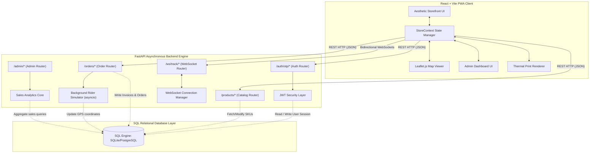
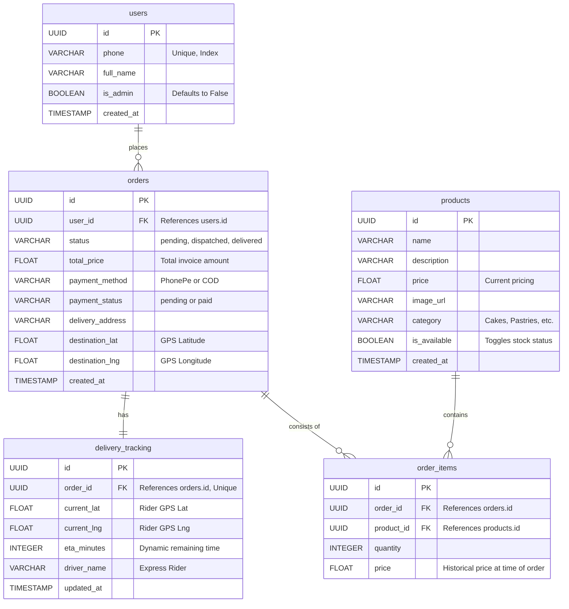
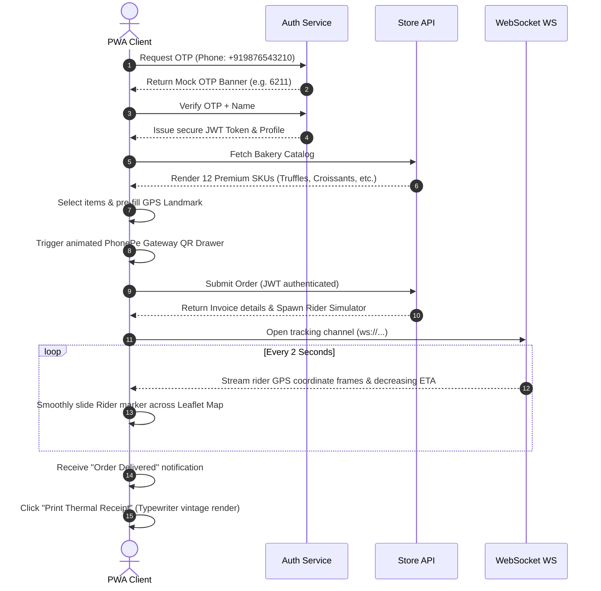

# 🍰 Cake-Wala: Production-Grade Mobile-First Bakery Order & Live Delivery PWA

Cake-Wala is a highly aesthetic, production-grade Progressive Web App (PWA) storefront and live delivery tracking system for a premium bakery. It is engineered with modern, decoupled client-server principles, relies entirely on free-tier parities (Supabase PostgreSQL / SQLite fallback, Render FastAPI backend, and Vercel/Netlify Vite-React frontend), and is designed to scale effortlessly.

---

## 🏗️ 1. System Architecture & Design

The application operates as a decoupled client-server system. The React frontend provides a responsive 480px frame optimal for mobile users, using modern typography, glassmorphism, HSL color palettes, and micro-animations. The FastAPI backend serves secure REST APIs and high-performance WebSockets to broadcast live GPS delivery coordinates.



---

## 💾 2. Database Design & Flow (ERD)

The database design ensures **transactional integrity**. If a cake's current catalog price changes due to inflation, completed invoices remain completely untouched. This historical price isolation is maintained by capturing the item's purchase price inside the `order_items` transactional table at the checkout event.



---

## 🍰 3. Core Development Modules

### 🛡️ Module A: Passwordless Phone OTP Authentication
* **Backend**: Dispatched via `/auth/otp/send`. It generates a random 4-digit code and logs it directly to the server terminal. To keep testing 100% free, the OTP is returned in the mock SMS API response, showing a beautiful helper banner in the client! `/auth/otp/verify` validates the OTP code, dynamically creates the user's profile on the fly if it's their first order, and issues a secure JWT token.
* **Master Developer Bypass**: Supports a master developer override (`1234`) on any number to allow frictionless sandboxed developer sign-in.

### 🛒 Module B: Catalog & Order Engine
* **Catalog API**: Exposes dynamic category routing (Cakes, Pastries, Breads, Cookies) to build premium filters.
* **Invoice Safe-Calculations**: When checking out, the backend queries the database for accurate prices to calculate totals, preventing malicious users from trying to tamper with pricing in the cart. 

### 🏍️ Module C: WebSocket Connection Manager & Rider Simulator
* **Background Task**: When a user checks out, an asynchronous background task (`asyncio.create_task`) is spawned. It simulates a delivery rider traveling along a linear route from the Indiranagar Bakery HQ (`12.97189`, `77.64115`) to the customer's selected Bangalore landmark GPS coordinates.
* **WebSockets**: The client establishes a persistent connection to `/ws/track/{order_id}`. The backend streams real-time rider coordinates and decreasing ETA numbers to the client every 2 seconds, which dynamically shifts the rider icon across the Leaflet.js map.

### 👑 Module D: Admin Analytics & Inventory Dashboard
* **Sales Analytics Core**: Aggregates all orders in the SQL database to calculate total store revenue, order counts, unique customers, and compiles a real-time leaderboard of best-selling treats.
* **Stock & Price Control**: Enables the admin to dynamically change product pricing, toggle products as "Sold Out" (reflecting immediately in the storefront catalog), or delete/add new SKUs.

---

## 🔄 4. Operational User Flows

### 🧑‍💻 The Customer Flow


### 👑 The Admin / Storeowner Flow
1. **Security Authentication**: The admin signs in with `+919988776655` using the master developer key `1234`.
2. **Authorization Handshake**: The backend confirms the admin flag (`is_admin=True`) is set inside the database, unlocking access to `/admin/*` routes.
3. **Live Sales Monitoring**: The React frontend requests `/admin/analytics` to render the floating analytics cards (Total Revenue, Order Count, Customer Metrics, dynamic SKU sales leaderboard charts).
4. **Inventory Adjustments**: 
   * The owner toggles a cupcake as **Sold Out**.
   * The backend updates the `is_available` column to `False`.
   * Standard customer apps immediately filter out the cupcake from their catalog, preventing orders on out-of-stock items.

---

## 🛠️ 5. Local Setup & Verification

### Prerequisites
- Node.js (v18+)
- Python (v3.10+)

### Setup Backend Server
```bash
cd backend
python -m venv .venv
.venv\Scripts\activate
pip install -r requirements.txt

# Initial database seed (creates cakewala.db with products & default admin)
python -m app.seed

# Start FastAPI Dev Server
python -m uvicorn app.main:app --reload --port 8000
```

### Setup Frontend Server
```bash
cd ../frontend
npm install
npm run dev
```
Open **`http://localhost:5174`** (or the outputted port) in your browser.

* **Sign in as Patron**: Use any mobile number (e.g. `+919876543210`) and enter the OTP shown in the custom developer SMS helper banner.
* **Sign in as Admin**: Use mobile number `+919988776655` and enter the developer master key `1234` to access the Admin crown panel.
